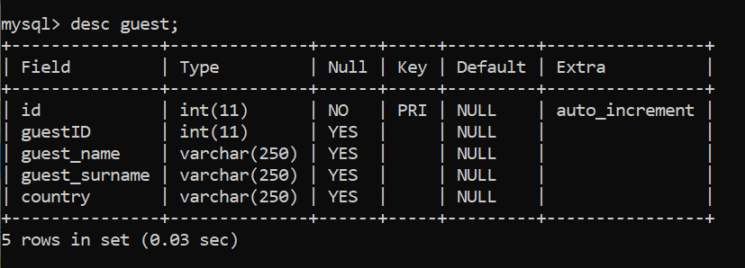
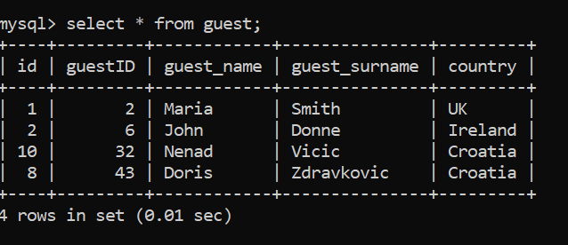
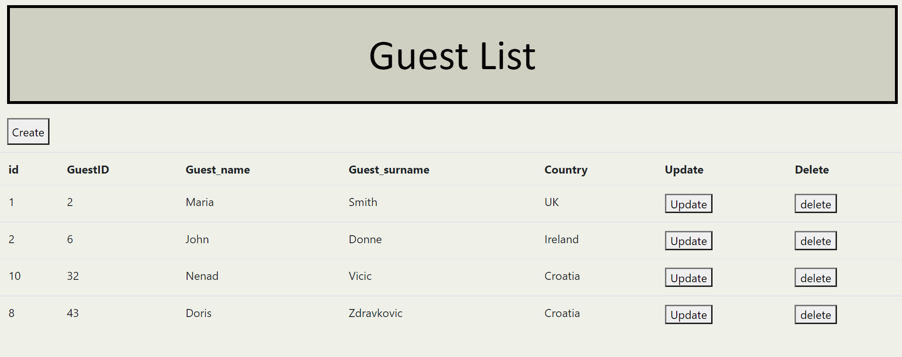
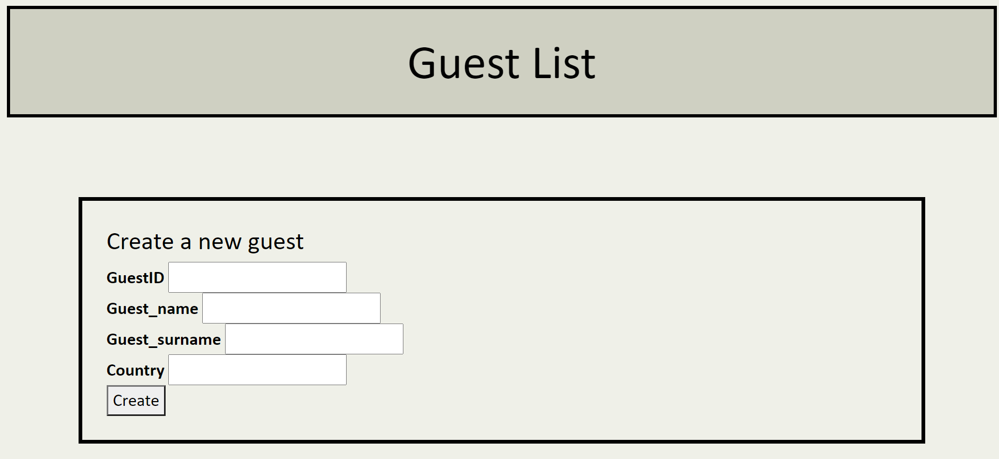

# Data representation: Project

The aim of this project is to make a web application called hotel_guests that will
have hotel guest database which will be easy to navigate. It has a flask server that has REST API
to perform CRUD operations on an accompanying web interface. 

My project is based on retrieving data from MySql database called hotel_guests. Within this database there is a table called 
guest with some data about guest that visited hotel. 

### Contents of this repository

The repository contains: 

- gitignore: to ignore files like config files and venv to perform on virtual machine.

- readme: information about the project

- dbconfig: configuration file with my credentials to MySql database

- hotel_guestsDAO: Python DAO file to connect to the MySql database and retrieve data.

- initdb.sql: the commands used to create the database and the table in MySql

- requirements.txt: contains list of packages that should be installed in a virtual machine to run the server

- server.py: Python app server which should be run in a virtual environment

### Step by step:

#### Virtual machine

- .\venv\Scripts\activate.bat: to activate virutal machine
- pip install -r requirements.txt: to install all the packages needed to run the application listed in requirements.txt

#### Server.py

- set FLASK_APP=server.py: using server.py script
- python -m flask run: to get the server running in the virtual environment
- I got a message saying: "Running on http://127.0.0.1:5000/"
- I ran http://127.0.0.1:5000/ on my web browser.

#### Downloading the repository

1. Go to GitHub.
2. Navigate to the main page of the repository:https://github.com/doriszd/data_rep_project
3. Under the repository name, click Clone or download
4. Save the repository to a local folder location on your computer.
5. Navigate to your target directory in the command line
6. To add new content on gitHub type add .
7. Type git commit -m "Write a message here"
8. To send it to gitHub type git push

### MySql Database

I have created MySql database called hotel_guests for the purpose of this project. In order to show description of guest table in MySql database I used command: desc guest; 

The database contains one table called guests that has 5 categories:
1. ID: PRIMARY KEY that is auto-increment
2. guest_ID: unique guest number
3. guest_name: Name of the guest staying in a hotel
4. guest_surname: Surname of the guest staying in a hotel
5. country: Country that the guest is coming from

To show all details about the guests staying at the hotel I used mysql command: select * from guest;

This is a web application that would be available to an end user that works in a hotel. Web application allows end user to create information about new guests, update and delete them. 
The web application is connected to mysql database hotel_guests so it will update every time an end user makes some changes in the web application. 

#### Home page:

#### Create a new guest page:

References:

- https://stackoverflow.com/questions/38014315/jquery-ajax-does-not-update-values-in-mysql/38014391
- https://www.w3schools.com/css/css_margin.asp
- https://flask.palletsprojects.com/en/2.0.x/
- https://www.w3schools.com/sql/sql_drop_db.asp
- https://codehandbook.org/python-flask-jquery-ajax-post/
- http://www.csgnetwork.com/htmlcodetest.html
- https://stackoverflow.com/questions/38563589/curl-no-url-specified-for-restful-api
